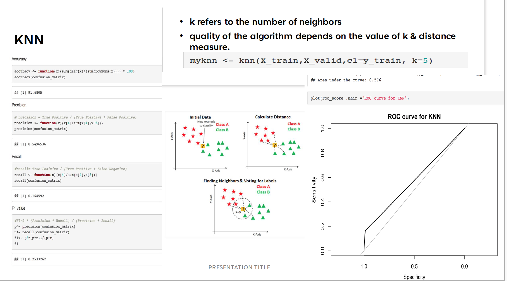

# Employe-Promotion-Predection

Problem Statement:
The dataset that we have picked is an HR dataset. Each year, the company promotes 5% of its employees. One of the challenges that the company faces is identifying the eligible candidates at the right time so that there is no delay in the transition process.
Therefore, we want to predict the employees who are going to be promoted using various prediction models. We then plan to Analyse the models and find the best fit for the given data. That is given the employee details, we would like to predict if the employee is going to be promoted or not.

Dataset: (Description)
This dataset comprises more than 50000 rows and 13 features in the form of column, out of which we may opt to use only the essential features during implementation.

Source of Dataset: https://www.kaggle.com/datasets/shivan118/hranalysis

Implementation Strategy and algorithms Used
We have decided to implement and compare the following models:
a. KNN

./Screen Shot 2024-02-27 at 6.29.51 PM.png
b. Naive Bayes
c. Random Forest
d. Logistic Regression
e. Support Vector Machine
f. AdaBoost
g. Multilayer Perceptron
h. XGBoost
Model metrics and Evaluation:
We are going to evaluate the model using various metrics like Confusion Matrix, Precision, Recall, AUC-ROC, F1score, among others.
We will then find the accuracy of each of the models and identify which is a better fit for our data.

